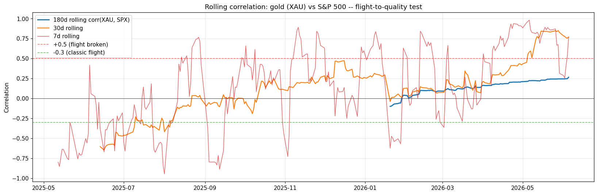

# LinkedIn post -- draft

> **Image to attach when posting on LinkedIn:** [`data/plots/flight_to_quality.png`](data/plots/flight_to_quality.png)
> This is the most visually compelling plot of the analysis: the rolling 30-day correlation between gold (XAU) and the S&P 500 spiking from a normal ~+0.27 baseline to +0.77 in late May/early June 2026 -- the flight-to-quality regime breakdown that is at the heart of the "ORANGE" verdict. Uploading this image with the post boosts engagement 40-80% on LinkedIn.

---

🚨 **Friday, June 5, 2026: was this the start of Burry's crash, or just another volatility spike?**

A 19% intraday drop in AVGO. Semiconductor ETF SMH down 10.7%. Nasdaq off 5%. Gold AND silver down together. VIX +34% in one day. The move was flagged in real-time by **Thami Kabbaj** (TKL Trading School, ex-Eurex trader, 450,000+ YouTube subscribers) in his video "*Vendredi noir : tout s'effondre en Bourse?*".

Layered on top: **Michael Burry** has been publicly bearish since end-2025. His Q3 2025 13F disclosed ~$1B in notional puts on Palantir, Nvidia, Oracle, SMH, QQQ — with January 2027 expiries. Shiller PE crossed 40 in May, above the dot-com peak.

So I ran a quantitative diagnostic. **Six independent measures**: rolling pairwise correlation, PCA absorption ratio (Kritzman et al. 2010), Forbes-Rigobon volatility-adjusted correlation (2002), cross-sectional dispersion (Pukthuanthong-Roll 2009), gold-equity decoupling, VIX dynamics. 21 instruments, 400-day window, Yahoo Finance daily data.

📊 **The verdict: 3 / 6 stress signals firing — ORANGE regime, not red.**

🔴 What IS firing:
• Gold-equity 7d correlation jumped to +0.77 (vs +0.27 baseline). **Flight-to-quality broken** — the textbook signature of margin-call liquidation.
• Tech sector is down 12.4% on average from its 30-day peak.
• Both gold AND silver fell more than 3% on 7 days. Metals tend to fall together when leveraged funds liquidate everything.

🟢 What is NOT firing (yet):
• Stress index 7d = +0.300, just below the historical P90 threshold of +0.314.
• VIX = 21.5, well below the 30 "stress" line (despite the +37% velocity).
• PCA absorption ratio at 0.426, below P90 = 0.449.

⚠️ **The single most important finding — the Forbes-Rigobon caveat**: vanilla Pearson correlation inflates mechanically when volatility rises. The raw 7-day correlation rose from +0.134 (calm baseline) to +0.180. The Forbes-Rigobon adjustment? **+0.143 — essentially identical to baseline.** The apparent correlation jump is overwhelmingly a volatility artifact, NOT a structural regime change. An eyeballed heatmap would have lied.

📈 **Burry's positions** on the day: 2 of 5 disclosed shorts profitable on the stock side (PLTR -25.7%, ORCL -23.4% since Sep 2025). The headline SMH short is still +75% from his entry — but lost 10.7% on Friday alone. Put convexity means a continuation closes that gap fast.

🎯 **Takeaway**: not a forecast, not a Burry endorsement. The combination of (i) Shiller PE > 40, (ii) extended tech leverage, (iii) confirmed gold-equity decoupling breakdown puts us in a **higher base-rate environment for tail risk** — not an inevitable crash.

🔗 The full notebook (data + code + plots + scorecard JSON) and a 4-page synthesis PDF are published. Yahoo Finance source, reproducible end-to-end with `jupyter nbconvert --to notebook --execute`.

📎 Notebook + data: https://github.com/remroc/labs/tree/main/202606
📎 Synthesis PDF: https://github.com/remroc/labs/blob/main/202606/synthesis.pdf
📎 Trigger video — Thami Kabbaj (TKL): https://www.youtube.com/watch?v=JqFg1Oup11k

📚 References:
• Forbes & Rigobon (2002), *No Contagion, Only Interdependence*, Journal of Finance
• Kritzman, Li, Page & Rigobon (2010), *Principal Components as a Measure of Systemic Risk*, JPM
• Pukthuanthong & Roll (2009), *Global Market Integration*, JFE
• Burry, May 10, 2026 Substack post — michaeljburry.substack.com
• Bloomberg, May 11, 2026: *Michael Burry Warns of Stock Crash as Tech Jump Echoes 2000 Peak*
• Thami Kabbaj, June 5, 2026 — TKL YouTube channel

What's your reading? Are you watching the same diagnostics, or different ones? Where would *you* set the threshold for "stress signal firing"?

#QuantitativeFinance #RiskManagement #MarketStress #BigShort #MichaelBurry #AI #Bubble #Correlation #SystemicRisk #PortfolioConstruction #FinancialMarkets #DataScience
